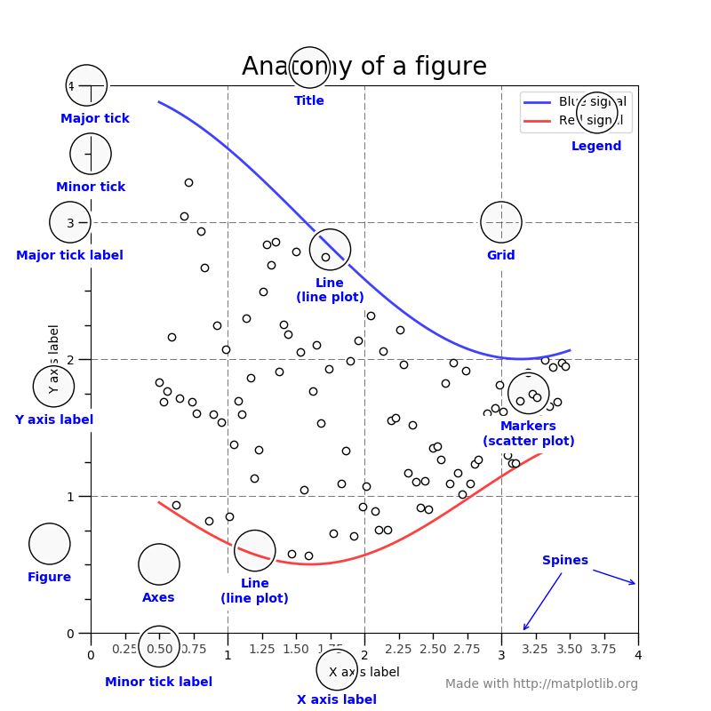

---
jupyter:
  jupytext:
    text_representation:
      extension: .Rmd
      format_name: rmarkdown
      format_version: '1.1'
      jupytext_version: 1.2.4
  kernelspec:
    display_name: Python 3
    language: python
    name: python3
---

<!-- #region {"slideshow": {"slide_type": "slide"}} -->
# Python w zastosowaniach naukowych
                
## Wykład 8
### mgr inż. Maciej Kwiatkowski
<!-- #endregion -->

<!-- #region {"slideshow": {"slide_type": "slide"}} -->
## IPython
<!-- #endregion -->

<!-- #region {"slideshow": {"slide_type": "fragment"}} -->
[Ipython](https://ipython.org/) to rozbudowany projekt wspierający interaktywne obliczenia. W ramach projektu tworzone są:
* *interaktywna konsola* (REPL - *Read Evaluate Print Loop*) o wiele bardziej rozbudowana niż wbudowana konsola Pythona,
* *kernel* Pythona - usługa interpretera,
* *debugger*,
* narzędzia do *zrównoleglania* obliczeń,
* *GUI* wykorzystujące przeglądarkę internetową (obecnie jest to już oddzielny projekt, niezależny od języka Python) - **Jupyter**
<!-- #endregion -->

<!-- #region {"slideshow": {"slide_type": "fragment"}} -->
Ipython jest dostępny jako paczka instalowalna przez pip: `pip install ipython`
<!-- #endregion -->

<!-- #region {"slideshow": {"slide_type": "subslide"}} -->
Główne cechy interaktywnej konsoli:
* przechowywanie historii wejść (również między sesjami),
* przechowywanie historii wyjść (w ramach sesji),
* kolorowanie składni,
* lepsza interakcja z blokiem kodu (możliwość wczytania bloku kodu z historii),
* komendy magiczne: `%` (dla linii) i `%%` (blok kodu) pozwalające m.in. na komunikację z os, zarządzanie plikami etc.,
<!-- #endregion -->

```{python slideshow={'slide_type': 'fragment'}}
print?
```

<!-- #region {"slideshow": {"slide_type": "subslide"}} -->
### Profilowanie z użyciem metod magicznych IPythona
<!-- #endregion -->

<!-- #region {"slideshow": {"slide_type": "fragment"}} -->
Profilowanie to rodzaj dynamicznej (z udziałem użytkownika) analizy kodu pod względem m.in. złożoności czasowej i pamięciowej. 

Przykład sprawdzenia kodu pod wględem czasu wykonania:
<!-- #endregion -->

```{python slideshow={'slide_type': 'fragment'}}
# %timeit sum(range(int(1e6)))
```

```{python slideshow={'slide_type': 'fragment'}}
# %%timeit
_sum = 0
for ii in range(int(1e6)):
    _sum += ii
```

<!-- #region {"slideshow": {"slide_type": "slide"}} -->
## Jupyter
<!-- #endregion -->

<!-- #region {"slideshow": {"slide_type": "fragment"}} -->
[Jupyter notebook](https://jupyter-notebook.readthedocs.io/en/stable/) to graficzny interfejs użytkownika (*GUI*) rozwijany w ramach projektu [Jupyter](https://jupyter.org). Interfejs ten jest aplikacją uruchamianą w przeglądarce rozszerzająca funkcjonalność interaktywnej konsoli Ipython jednocześnie pozwalając na przechowywanie sesji w formie pliku z rozszerzeniem `.ipynb`.
<!-- #endregion -->

<!-- #region {"slideshow": {"slide_type": "fragment"}} -->
Podobnie jak Ipython jest dostępny jako paczka instalowalna przez pip: `pip install jupyter`.
<!-- #endregion -->

<!-- #region {"slideshow": {"slide_type": "subslide"}} -->
Proces jupytera uruchamia się za pomocą komendy `jupyter notebook`.
<!-- #endregion -->

<!-- #region {"slideshow": {"slide_type": "fragment"}} -->
Komenda uruchamia *serwer* notebooka, który dostępny jest w sieci lokalnej. W domyślnej instalacji uruchomienie serwera uruchamia domyślną przeglądarkę / dodaje kartę z interfejsem. 
<!-- #endregion -->

<!-- #region {"slideshow": {"slide_type": "fragment"}} -->

[Żródło](https://jupyter.readthedocs.io/en/latest/_images/notebook_components.png)
<!-- #endregion -->

<!-- #region {"slideshow": {"slide_type": "fragment"}} -->
W interfejsie notebooka istotne są dwa widoki:
* `tree` będącego głównie eksploratorem plików (root folderem jest folder uruchomienia serwera), oraz
* `notebooks` pozwalającym na edycję notebooków.
<!-- #endregion -->

<!-- #region {"slideshow": {"slide_type": "subslide"}} -->
*Kernel* to proces, który wykonuje obliczenia zdefiniowane w notebooku. Do jednego kernela można odwołać się z kilku notebooków. 

Przykładem takiego kernela jest IPython, ale dostępne są również kernele dla języka R, Julia (oficijalnie wspierane) oraz inne,  napisane przez community.
<!-- #endregion -->

<!-- #region {"slideshow": {"slide_type": "fragment"}} -->
Sam Jupyter jest dość rozbudowanym projektem z bardziej rozbudowanym intefejsem zakrawającym o IDE ([Jupyter Labs](https://jupyterlab.readthedocs.io/en/latest/)), usługą pozwalającą na serwowanie współdzielonych notebooków ([Jupyter Hub](https://jupyterhub.readthedocs.io/en/stable/)). Są także miejsze paczki pozwalające np. na eksportowanie notebooka do innych formatów ([`nbconverter`](https://nbconvert.readthedocs.io/en/latest/)) czy zamiany w interaktywną prezentację [`rise`](https://rise.readthedocs.io/en/maint-5.6/))
<!-- #endregion -->

<!-- #region {"slideshow": {"slide_type": "fragment"}} -->
W ramach zajęć będziemy korzystać z podstawowej (out of the box) wersji notebooka. 
<!-- #endregion -->

<!-- #region {"slideshow": {"slide_type": "subslide"}} -->
### Zalety:
<!-- #endregion -->

<!-- #region {"slideshow": {"slide_type": "fragment"}} -->
* Pozwala na szybkie prototypowanie kodu,
* Pozwala na szybką analizę danych / tworzenie kodu do obliczeń (przechowywanie wyniku każdej lini),
* Ułatwia prezentowanie wyników, robienie prezentacji ad hoc.
<!-- #endregion -->

<!-- #region {"slideshow": {"slide_type": "fragment"}} -->
### Wady
<!-- #endregion -->

<!-- #region {"slideshow": {"slide_type": "fragment"}} -->
* Dzielenie kodu między notebookami jest problematyczne:
    * możemy albo podłączyć kilka konsol do jednego kernela i w efekcie mieć dostęp do przestrzeni nazw, ale jest ona wspólna dla wszystkich,
    * musimy ręcznie wydzielać kod do zależności,
* Format notebooka jest nieczytelny dla nieprogramistów, więc trzeba dodać trochę *boilerplate* kodu przed prezentacją,
* Wersjonowanie wymaga pewnych tricków, ale i tak może stwarzać problemy, gdy nad plikiem ma pracować więcej osób.
* Długie sesje / duże *outputy* mogą spowolnić / uniemożliwić pracę (ale można to obejść ustawiając historię i cache na 0).
<!-- #endregion -->

<!-- #region {"slideshow": {"slide_type": "slide"}} -->
## Matplotlib 
<!-- #endregion -->

<!-- #region {"slideshow": {"slide_type": "subslide"}} -->
### Uruchomienie
<!-- #endregion -->

<!-- #region {"slideshow": {"slide_type": "fragment"}} -->
Matplotlib jest "inspirowaną" MATLABem paczką do tworzenia wykresów i animacji.
<!-- #endregion -->

<!-- #region {"slideshow": {"slide_type": "fragment"}} -->
Instalacja przez pip: `pip install matplotlib`.

**UWAGA**: Matplotlib wymaga numpy!
<!-- #endregion -->

<!-- #region {"slideshow": {"slide_type": "fragment"}} -->
### Importowanie
<!-- #endregion -->

<!-- #region {"slideshow": {"slide_type": "fragment"}} -->
W paczce występują dwa moduły `pyplot` i `pylab`. `pyplot` jest modułem zawierającym funkcje odpowiedzialne za tworzenie wykresów. `pylab` zawiera przestrzeń nazw zbliżoną do MATLABA (zarówno funkcje odpowiedzialne za wykreślanie jak i obliczenia w numpy). 

Zalecam używanie `pyplot`: `import matplotlib.pyplot as plt`
<!-- #endregion -->

<!-- #region {"slideshow": {"slide_type": "subslide"}} -->
### Przykład użycia
<!-- #endregion -->

```{python slideshow={'slide_type': 'fragment'}}
import matplotlib.pyplot as plt
import numpy as np
```

```{python slideshow={'slide_type': 'fragment'}}
x = np.linspace(0, 5, 10)
y = x ** 2
```

```{python slideshow={'slide_type': 'fragment'}}
# Jupyter domyślnie rysuje wykres wewnątrz dokumentu.
# # %matplotlib inline
# Ale można zmienić to na rysowanie do oddzielnego okna, np.:
# # %matplotlib tk
# Możliwe jest zamiana backendu na pozwalający na interakcję z rysunkiem
# UWAGAPrzy zmianie backendu konieczne jest zrestartowanie kernela!
# # %matplotlib notebook
plt.plot(x,y, 'r-*')  # nie mamy dostępu do tego wykresu
```

<!-- #region {"slideshow": {"slide_type": "subslide"}} -->
### Składowe wykresu
<!-- #endregion -->

<!-- #region {"slideshow": {"slide_type": "fragment"}} -->

[Żródło](https://matplotlib.org/_images/anatomy1.png)
<!-- #endregion -->

<!-- #region {"slideshow": {"slide_type": "subslide"}} -->
### Figure i axes
<!-- #endregion -->

<!-- #region {"slideshow": {"slide_type": "fragment"}} -->
Podstawowym obiektem w module jest `figure` (rycina(?) albo obrazek), który w swojej przestrzeni może zawierać wiele `axes` (układów współrzędnych/wykresów). To rozróżnienie jest istotne, dlatego proszę zapamiętać, że:
* `axes` związane jest ze sposobem prezentowania danych (na poprzednim rysunku większość zaznaczonych obiektów było atrybutami wykresu),
* `figure` związany jest z ogólnymi parametrami rysunku jako grafiki, która może być zapisana.
<!-- #endregion -->

```{python slideshow={'slide_type': 'fragment'}}
fig = plt.figure()  # obrazek zawierający wszystkie wykresy

ax_1 = fig.add_axes([0.1, 0.1, 0.8, 0.8]) # głowny wykres
ax_2 = fig.add_axes([0.2, 0.5, 0.4, 0.3]) # wykres zagnieżdżony

# main figure
ax_1.plot(x, y, 'r')
ax_1.set_xlabel('x')
ax_1.set_ylabel('y')
ax_1.set_title('f(x)')

# insert
ax_2.plot(y, x)
ax_2.set_xlabel('y')
ax_2.set_ylabel('x')
ax_2.set_title('f^-1(x)');
```

```{python slideshow={'slide_type': 'fragment'}}
# mając referencję do obiektu możemy go edytować
ax_2.set_position([0.3, 0.5, 0.4, 0.3])  
```

```{python slideshow={'slide_type': 'fragment'}}
fig
```

<!-- #region {"slideshow": {"slide_type": "subslide"}} -->
### Wiele wykresów
<!-- #endregion -->

```{python slideshow={'slide_type': 'fragment'}}
# Pomocnicza funkcja
def plot_multiple(axes, x, ys):
    for ii, (ax, y) in enumerate(zip(axes, ys), 1):
        ax.plot(x, y, 'r')
        ax.set_xlabel('x')
        ax.set_ylabel('y')
        ax.set_title(f'title {ii}')
```

```{python slideshow={'slide_type': 'fragment'}}
x = np.linspace(0, 10, 100)
ys = np.vstack([np.sin(x), 4*np.cos(x)])
# metoda domyślnie tworzy wiele wykresów w ramach jednego obrazka
fig, axes = plt.subplots(nrows=1, ncols=2)  
plot_multiple(axes, x, ys)
```

```{python slideshow={'slide_type': 'fragment'}}
# Automatyczne dopasowywanie zawartości, żeby uniknąć nachodzenia na siebie
fig.tight_layout()
fig
```

```{python}
# W celu zwiększenia czytelności można uwspólnić oś
fig, axes = plt.subplots(nrows=1, ncols=2, sharey=True)
plot_multiple(axes, x, ys)
```

```{python slideshow={'slide_type': 'fragment'}}
# W celu lepszego dopasowania obrazka do zawrtości 
# można zmodyfikować proporcję obrazka przez parametr figsize
# przyjmujący tuplę (szerokość, wysokość)
fig, axes = plt.subplots(nrows=1, ncols=2, figsize=(12, 3))
plot_multiple(axes, x, ys)
fig.suptitle('Overall title')
```

<!-- #region {"slideshow": {"slide_type": "subslide"}} -->
### Legenda
<!-- #endregion -->

<!-- #region {"slideshow": {"slide_type": "fragment"}} -->
Legenda jest atrybutem wykresu. Można ją dodać do wykresu na dwa sposoby:
* inicjując etykiety przy rysowaniu (sugerowana metoda, ponieważ łączy etykietę z krzywą),
* etykietując każdą krzywą przy wstawianiu legendy.
<!-- #endregion -->

```{python slideshow={'slide_type': 'fragment'}}
import matplotlib as mpl
mpl.rcParams['font.size']=18
fig, axes = plt.subplots(ncols=2, figsize=(14, 6))

# etykietowanie przy rysowaniu
ax_1 = axes[0]
ax_1.plot(x, x**2, label="y = x**2")
ax_1.plot(x, x**3, label="y = x**3")
ax_1.legend(loc=2)  # parametr określa położenie legendy

# etykietowanie przy wstawianiu legendy
ax_2 = axes[1]
ax_2.plot(x, x**2)
ax_2.plot(x, x**3)
ax_2.legend(["y = x**2", "y = x**3"], loc=6)

fig.tight_layout()
for ax in axes:
    ax.set_xlabel('x')
    ax.set_ylabel('y')
```

```{python slideshow={'slide_type': 'fragment'}}
ax_1.lines.pop()
ax_1.plot(x, x**2.5, label="y")
ax_1.legend(loc=2)  # parametr określa położenie legendy
fig
```

<!-- #region {"slideshow": {"slide_type": "fragment"}} -->
Obecne etykiety nie są jeszcze w 100% akceptowalne, gdyż zawierają składnie kodu. W celu poprawienia ich czytelności można użyć skadni LaTeXa. Inne formatowanie (zmiana kroju/rozmiaru czionki) opisane jest [tutaj](https://matplotlib.org/3.1.1/tutorials/introductory/customizing.html).

**UWAGA**: Zalecam używania raw stringów, żeby nie trzeba było escapować '\' używangeo w znakach specjalnych LaTeXa.
<!-- #endregion -->

```{python}
ax_1.clear()
ax_1.plot(x, x**2, label=r"$y = x^2$")
ax_1.plot(x, x**2.5, label=r"$y = x^\alpha, \alpha=2.5$")
ax_1.legend(loc=2)
fig
```

```{python}
mpl.rcdefaults()  # przywraca domyślne stylowanie
```

<!-- #region {"slideshow": {"slide_type": "subslide"}} -->
### Bliźniacze osie
<!-- #endregion -->

<!-- #region {"slideshow": {"slide_type": "fragment"}} -->
W niektórych przypadkach przydatne będzie naniesienie dwóch osi na jeden wykres.Można to zrealziować za pomocą metody `twinx` lub `twiny`.
<!-- #endregion -->

```{python slideshow={'slide_type': 'fragment'}}
fig, ax1 = plt.subplots()

ax1.plot(x, x**2, lw=2, color="blue")
ax1.set_ylabel(r"area $(m^2)$", fontsize=18, color="blue")
for label in ax1.get_yticklabels():
    label.set_color("blue")
    
ax2 = ax1.twinx()
ax2.plot(x, x**3, lw=2, color="red")
ax2.set_ylabel(r"volume $(m^3)$", fontsize=18, color="red")
for label in ax2.get_yticklabels():
    label.set_color("red")
```

<!-- #region {"slideshow": {"slide_type": "fragment"}} -->
Osie nie muszą być w tej samej skali.
<!-- #endregion -->

```{python slideshow={'slide_type': 'fragment'}}
fig, ax1 = plt.subplots()

ax1.plot(x, x**2, lw=2, color="blue")
ax1.set_ylabel(r"area $(m^2)$", fontsize=18, color="blue")
for label in ax1.get_yticklabels():
    label.set_color("blue")
    
ax2 = ax1.twinx()
ax2.semilogy(x, x**3, lw=2, color="red")
ax2.set_ylabel(r"volume $(m^3)$", fontsize=18, color="red")
for label in ax2.get_yticklabels():
    label.set_color("red")
```

<!-- #region {"slideshow": {"slide_type": "subslide"}} -->
### Inne typy wykresów
<!-- #endregion -->

```{python slideshow={'slide_type': 'fragment'}}
n = np.array([0,1,2,3,4,5])
xx = np.linspace(-0.75, 1., 100)
```

```{python slideshow={'slide_type': 'fragment'}}
fig, axes = plt.subplots(2,2, figsize=(10,8))

axes[0, 0].scatter(xx, xx + 0.25*np.random.randn(len(xx)))
axes[0, 0].set_title("scatter")

axes[0, 1].step(n, n**2, lw=2)
axes[0, 1].set_title("step")

axes[1, 0].bar(n, n**2, align="center", width=0.5, alpha=0.5)
axes[1, 0].set_title("bar")

axes[1, 1].fill_between(x, x**2, x**3, color="green", alpha=0.5);
axes[1, 1].set_title("fill_between");

fig.tight_layout()
```

<!-- #region {"slideshow": {"slide_type": "subslide"}} -->
#### Histogramy 
<!-- #endregion -->

```{python slideshow={'slide_type': 'fragment'}}
n = np.random.randn(100000)
fig, axes = plt.subplots(1, 2, figsize=(12,4))

axes[0].hist(n)
axes[0].set_title("Default histogram")
axes[0].set_xlim((min(n), max(n)))

axes[1].hist(n, cumulative=True, bins=50)
axes[1].set_title("Cumulative detailed histogram")
axes[1].set_xlim((min(n), max(n)));
```

<!-- #region {"slideshow": {"slide_type": "subslide"}} -->
#### Wykres we współrzędnych polarncyh
<!-- #endregion -->

```{python slideshow={'slide_type': 'fragment'}}
fig = plt.figure()
# parametr polar zmienia typ wykresu
ax = fig.add_axes([0.0, 0.0, .6, .6], polar=True)
t = np.linspace(0, 2 * np.pi, 100)
ax.plot(t, t, color='blue', lw=3);
```

<!-- #region {"slideshow": {"slide_type": "subslide"}} -->
#### Wykres z niepewnościami
<!-- #endregion -->

```{python slideshow={'slide_type': 'fragment'}}
x = np.arange(0, 100)
data = np.random.randint(10, 1000, (100))
data.sort()
stddev = np.sqrt(data)
xerr = np.ones_like(x)
plt.errorbar(x, data, xerr=xerr, yerr=stddev)
plt.xlim(0, 100);
```

<!-- #region {"slideshow": {"slide_type": "subslide"}} -->
#### Prezntowanie macierzy
<!-- #endregion -->

```{python}
def f(x,y):
    return (1-x/2+x**5+y**3)*np.exp(-x**2-y**2)

n = 10
x = np.linspace(-3,3,3.5*n)
y = np.linspace(-3,3,3.0*n)
X,Y = np.meshgrid(x,y)
Z = f(X,Y)

fig, axes = plt.subplots(2, 2, figsize=(10, 8))
for ax, interp in zip(
    axes.flatten(), 
    [None, 'nearest', 'bilinear', 'bicubic']
):
    im = ax.imshow(
        Z,
    #     interpolation=None, 
        interpolation=interp, 
        cmap='bone', 
        origin='lower',
    )
    ax.axis('off')
    

fig.subplots_adjust(right=0.8)
cbar_ax = fig.add_axes([0.85, 0.15, 0.05, 0.7])
fig.colorbar(im, cax=cbar_ax, shrink=.92);
```

<!-- #region {"slideshow": {"slide_type": "subslide"}} -->
### Zapis obrazka
<!-- #endregion -->

<!-- #region {"slideshow": {"slide_type": "fragment"}} -->
Jak już wspomniałem zapis jest metodą obrazka :). Przed zapisaniem obrazka polecam sprawdzić, czy wszystkie wykresy układają się poprawnie.
<!-- #endregion -->

<!-- #region {"slideshow": {"slide_type": "fragment"}} -->
Ważnymi atrybutami: 
* dpi (*dot per inch*) - im większy tym większy obrazek, ale przy złożonych wykresach zapewnia czytelność (nie będą "rozpikselowane"),
* format (rozpoznawany po rozszerzeniu) - osobiście polecam png (nie kompresowalny).
<!-- #endregion -->

```{python slideshow={'slide_type': 'fragment'}}
fig.savefig('img1.png', dpi=100)
fig.savefig('img2.png', dpi=200)
```

```{python slideshow={'slide_type': 'fragment'}}
# %system ls -lh img*
```

<!-- #region {"slideshow": {"slide_type": "slide"}} -->
## Przydatne linki
<!-- #endregion -->

<!-- #region {"slideshow": {"slide_type": "fragment"}} -->
* [A gallery of interesting Jupyter Notebooks](https://github.com/jupyter/jupyter/wiki/A-gallery-of-interesting-Jupyter-Notebooks#general-topics-in-scientific-computing)
* [Kurs Matplotlib, inspiracja dla części wykładu](https://nbviewer.jupyter.org/github/jrjohansson/scientific-python-lectures/blob/master/Lecture-4-Matplotlib.ipynb#)
* [Inny kurs, trochę bardziej przekrojowy](https://github.com/rougier/matplotlib-tutorial)
<!-- #endregion -->
